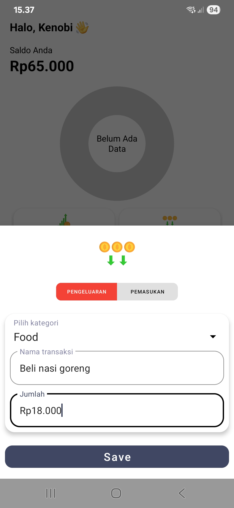

# Geby Saldo | Personal Finance Tracker 💰

A modern Android application built with **Kotlin**, **Room Database**, and **Jetpack DataStore** to help users manage their personal finances. Users can track income, expenses, and savings with an intuitive interface and visual insights.

---

## ✨ Features

- ➕ Add, edit, and delete transactions
- 📊 Income and expense visualization using pie chart
- 🏷️ Categorize transactions for better organization
- 💱 Choose and display preferred currency symbol
- 🌙 Light and Dark Mode support
- 🧠 Local data storage using **Room Database**
- ⚙️ User preference management via **Jetpack DataStore**
- 🧭 Smooth navigation using **Jetpack Navigation Component**
- 🧼 Clean MVVM architecture using ViewModel & LiveData

---

## 🔧 Tech Stack

| Technology           | Description                                |
|----------------------|--------------------------------------------|
| Kotlin               | Main programming language                  |
| Room Database        | Local DB for transaction storage           |
| Jetpack DataStore    | Save user preferences (currency, etc.)     |
| MPAndroidChart       | Charting library for income/expense data   |
| ViewBinding          | Type-safe view binding                     |
| Coroutines           | Background & asynchronous processing       |
| MVVM Architecture    | Separation of concerns                     |
| Navigation Component | In-app navigation across fragments         |

---

## 📸 Result Screenshots

<p float="left">
  
  
  
  
</p>

<p float="left">
  
  
  
  
</p>

<p float="left">
  
  
  
  
</p>

<p float="left">
  
  
</p>

---

## 🧪 Dependencies

Some of the main dependencies used in this project:

- `androidx.core:core-ktx`
- `androidx.appcompat:appcompat`
- `androidx.lifecycle:lifecycle-viewmodel-ktx`
- `androidx.navigation:navigation-fragment-ktx`
- `androidx.room:room-runtime`
- `androidx.room:room-ktx`
- `androidx.datastore:datastore-preferences`
- `com.github.PhilJay:MPAndroidChart:v3.1.0`
- `org.jetbrains.kotlinx:kotlinx-coroutines-core`

> For full list, refer to `build.gradle.kts` and/or `libs.versions.toml`

---

## 🛠️ Setup Instructions

1. **Clone this repository**
    ```bash
    git clone https://github.com/your-username/geby-saldo.git
    cd geby-saldo
    ```

2. **Open the project in Android Studio**
    - Recommended version: Android Studio Giraffe or newer

3. **Build the project**
    - Let Gradle sync and download all dependencies

4. **Run the app**
    - Supports devices with Android 7.0 (API 24) and above

---

## ⚠️ Notes

- This app stores all user data **locally on device** using Room Database.
- Currency format is customizable through the Settings menu.
- Dummy data is used for category templates.
- Multilanguage support is under development – the current version supports Indonesian only.
- No internet or third-party login is required — your data stays with you.

---

## 🙋‍♂️ Author

Developed by **Geby Ginting**  
📧 gebygintingg@gmail.com  
🔗 [LinkedIn – Geby Ginting](https://www.linkedin.com/in/geby-ginting)
